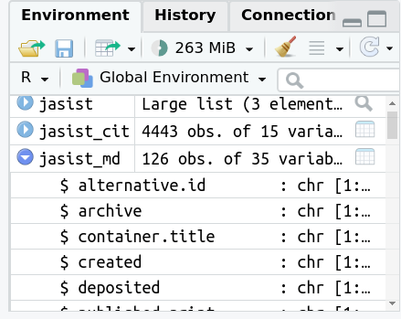

```{r setup, echo=FALSE, message=FALSE}
knitr::opts_chunk$set(
  comment = "#>",
  collapse = TRUE,
  warning = FALSE,
  message = FALSE,
  echo = TRUE,
  fig.width = 6,
  fig.asp = 0.618,
  dpi = 300)
```

### Setup

In einem ersten Schritt müssen einige wichtige R-Bibliotheken importiert werden.
Wichtig für die Analyse der Zitationen über Crossref ist die [`rcrossref`-Bibliothek](https://github.com/ropensci/rcrossref),
die den Datenabzug über einie der [von Crossref bereitgestellten Schnittstellen (API)](https://www.crossref.org/documentation/retrieve-metadata/rest-api/)
erleichtert.

```{r}
# tidyverse packages https://www.tidyverse.org/ 
library(dplyr) 
library(tidyr)
library(ggplot2)
# ropensci client for crossref
library(rcrossref) # R Client Crossref remote::install_github("ropensci/rcrossref)
# sna
library(sna)
library(network)
library(ggnet)
```

### Data

Zunächst sollen JASIST Publikationsmetadaten über die Crossref Schnittstelle gezogen werden.
Im folgenden Code-Schnippet wird die Funktion `cr_works` aus der `rcrossref`-Bibliothek aufgerufen.
Die Funktion hat zwei benannte Argumente: `filter` und `limit`. Während `limit` die Zahl der zurückgegebenen
Treffer begrenzt, wird mit `filter` angegeben, welche Werke aus der Gesamtmenge der Titel auf crossref
ausgegeben werden soll.
[Weitere Filtereinstellungen](https://docs.ropensci.org/rcrossref/reference/filters.html) sind in der entsprechenden Dokumentation zur R-Bibliothek zu finden.

Die Treffermenge wird mit dem `<-`-Operator der Variable `jasist` zugewiesen.
`jasist`, d.h. der Output der Funktion `cr_works`, gibt eine Liste mit drei Elementen zurück, von denen aber für die weitere Analyse nur das Element `data` interessiert, das die Publikationsmetadaten enthält.

Der Einfachheit halber wird also die Liste mit dem Namen `data` aus `jasist`-Liste in eine eigene Variable (`jasist_md`) geschrieben.

```{r}
jasist <- rcrossref::cr_works(filter = list(
  issn = "2330-1643",
  from_pub_date = "2020-01-01",
  until_pub_date = "2020-12-31"
), limit = 250)
jasist_md <- jasist$data
jasist_md
```

### Referenzanalyse

Wie viele und welche Publikationen referenzierten JASIST Artikel 2020?

`jasist_md` enthält die Publikationsmetadaten zu Aufsätzen aus der Zeitschrift JASIST
aus dem oben als Filter angegebenen Zeitraum.
Um den folgenden Code-Schnipsel zu verstehen, bietet es sich an,
die `jasist_md`-Daten etwas genauer anzuschauen.
In RStudio geht dies leicht über den Reiter *Environment*.
Mit einem Klick auf die jeweilige Variable lässt sich der Inhalt näher untersuchen.



Mit einem Klick auf das Tabellensymbol am rechten Rand der Zeile der Variable lässt
sich der Variableninhalt in einer eigenen Tabelle einsehen.

In dieser Ansicht entsprich eine Zeile einem Datensatz (= Zeitschriftenaufsatz).
Die letzte Spalte mit dem Titel *reference* enthält ihrerseits eine Liste.
Es handelt sich hierbei um eine Liste in einer Liste.

Diese Verschachtelung ist wichtig, um den folgenden Code-Schnipsel zu verstehen.

Hier werden aus `jasist_md` drei Spalten selektiert: `doi`, `title` und `reference`.
Die ersten beiden enthalten schlicht Strings (also einfachen Text).
Der komplexe Datentyp in der `reference`-Spalte lässt sich nicht ohne Weiteres in
einer Tabellenform darstellen; man müsste hier eigentlich eine Tabelle in eine
Zelle einfügen, was die Handhabung erheblich erschweren würde.

Hier kommt nun die Funktion `unnest` ins Spiel, die die verschachtelte Liste
(*nested list* auf Englisch) gewissermaßen auspackt.

Die Logik dahinter entspricht folgendem Schema:

```
| A | B | a b c | --> unnest --> | A | B | a |
| X | Y | x y z |                | A | B | b |
                                 | A | B | c |
                                 | X | Y | x |
                                 | X | Y | y |
                                 | X | Y | z |
```

Es wird also für jedes Element in der verschachtelten Liste der übergeordnete
Datensatz kopiert.

Im konkreten Beispiel führt dies dazu, dass `jasist_cit` letztlich eine Zeile
je in einem JASIST-Aufsatz zitierten Titel aufweist, wobei die ersten beiden
Spalten DOI und Titel des JASIST-Aufsatzes beinhalten (und so oft wiederholt
werden, wie es Referenzen im jeweiligen Aufsatz gibt), die restlichen Spalten jedoch
die bibliographischen Details des zitierten Titels.

```{r}
# referenzen
jasist_cit <- jasist_md %>%
  select(doi, title, reference) %>%
  unnest(reference)
jasist_cit
```

Die Vorschau gibt schon die Zahl der Zeilen (4443) an.
Möchte man sich jedoch per Funktion explizit ausgeben lassen, kann man hierfür
die `nrow()` verwenden:

```{r}
nrow(jasist_cit)
```

Verteilung

```{r}
# referenzen per artikel
cit_stat <- jasist_cit %>%
  group_by(doi) %>%
  summarise(ref_n = n_distinct(key),
            ref_cr = sum(!is.na(DOI))) %>%
  mutate(prop = ref_cr / ref_n)
cit_stat
```


top 10

```{r}
cit_stat %>%
  arrange(desc(ref_n))
```

Parameter

```{r}
# referenzen
summary(cit_stat$ref_n)
```

```{r}
# anteil referenzen mit crossref doi
summary(cit_stat$prop)
```

Verteilung Referenzen je Artikel

```{r}
ggplot(cit_stat, aes(ref_n)) +
  geom_density(fill = "#56b4e9") +
  theme_minimal() +
  labs(x = "Anzahl Referenzen je JASIST-Artikel")
```

### Netzwerkanalyse

Zitationsdaten

```{r}
cit_df <- jasist_cit %>%
  filter(!is.na(DOI)) %>%
  select(doi, ref_doi = DOI) %>%
  mutate(ref_doi = tolower(ref_doi)) %>%
  distinct()
```

Meist zitierte Arbeiten

````{r}
cit_df %>%
  count(ref_doi, sort = TRUE)
````

#### Zitationsmatrix und visualisierung

```{r}
# nur Artikel mit mehr als einer Zitation
dois_cit <- cit_df %>%
  count(ref_doi, sort = TRUE) %>%
  filter(n > 1)
my_cit <- cit_df %>%
  filter(ref_doi %in% dois_cit$ref_doi)
my_mat <- as.matrix(table(my_cit$doi, my_cit$ref_doi))
dim(my_mat)
```

Netzwerkobjekt für die Visualisierung

#### Welche Artikel sind bibliographisch gekoppelt

```{r}
mat_t <- my_mat %*% t(my_mat)
dim(mat_t)
```

Visualisierung

```{r}
net <- network::as.network.matrix(mat_t, directed = FALSE)
ggnet::ggnet2(net, size = "degree", color = "#56b4e9", alpha = 0.8) +
  geom_point(aes(color = color), color = "grey90") +
  guides(color = "none", size = "none") +
  labs(title = "Bibliographic coupling JASIST 2020")
```

#### Welche Artikel werden co-zitiert in JASIST-Artikeln von 2020


```{r}
mat_t <- t(my_mat) %*% (my_mat)
dim(mat_t)
```

Visualisierung

```{r}
net <- network::as.network.matrix(mat_t, directed = FALSE)
ggnet::ggnet2(net, size = "degree", color = "#56b4e9", alpha = 0.8) +
  geom_point(aes(color = color), color = "grey90") +
  guides(color = "none", size = "none") +
  labs(title = "Co-Citation network JASIST 2020")
```
