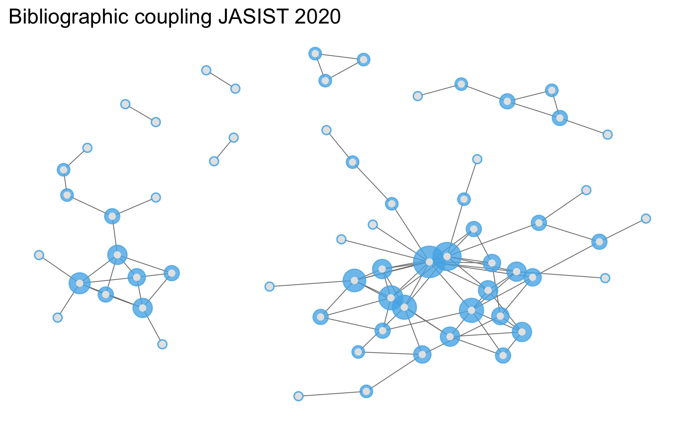

Netzwerke mit offenen Zitationsdaten
================

### Setup

``` r
# tidyverse packages https://www.tidyverse.org/ 
library(dplyr) 
library(tidyr)
library(ggplot2)
# ropensci client for crossref
library(rcrossref) # R Client Crossref remote::install_github("ropensci/rcrossref)
# sna
library(sna)
library(network)
library(ggnet)
```

### Data

JASIST Publikationsmetadaten über Crossref Schnittstelle beziehen

``` r
jasist <- rcrossref::cr_works(filter = list(
  issn = "2330-1643",
  from_pub_date = "2020-01-01",
  until_pub_date = "2020-12-31"
), limit = 250)
jasist_md <- jasist$data
jasist_md
#> # A tibble: 126 × 35
#>    alterna…¹ archive conta…² created depos…³ publi…⁴ publi…⁵ doi   indexed issn 
#>    <chr>     <chr>   <chr>   <chr>   <chr>   <chr>   <chr>   <chr> <chr>   <chr>
#>  1 10.1002/… Portico Journa… 2020-1… 2020-1… 2020-12 2020-1… 10.1… 2022-0… 2330…
#>  2 10.1002/… Portico Journa… 2020-1… 2021-0… 2021-05 2020-1… 10.1… 2022-0… 2330…
#>  3 10.1002/… Portico Journa… 2020-0… 2020-1… 2021-01 2020-0… 10.1… 2022-1… 2330…
#>  4 10.1002/… Portico Journa… 2020-0… 2020-1… 2020-12 2020-0… 10.1… 2022-0… 2330…
#>  5 10.1002/… Portico Journa… 2020-0… 2021-0… 2021-03 2020-0… 10.1… 2022-1… 2330…
#>  6 10.1002/… Portico Journa… 2020-1… 2021-0… 2021-05 2020-1… 10.1… 2022-0… 2330…
#>  7 10.1002/… Portico Journa… 2020-0… 2021-0… 2021-02 2020-0… 10.1… 2022-0… 2330…
#>  8 10.1002/… Portico Journa… 2020-0… 2020-1… 2021-01 2020-0… 10.1… 2022-0… 2330…
#>  9 10.1002/… Portico Journa… 2020-0… 2021-0… 2020-05 <NA>    10.1… 2022-0… 2330…
#> 10 10.1002/… Portico Journa… 2019-0… 2022-0… 2020-05 <NA>    10.1… 2022-0… 2330…
#> # … with 116 more rows, 25 more variables: issue <chr>, issued <chr>,
#> #   member <chr>, prefix <chr>, publisher <chr>, score <chr>, source <chr>,
#> #   reference.count <chr>, references.count <chr>,
#> #   is.referenced.by.count <chr>, subject <chr>, title <chr>, type <chr>,
#> #   update.policy <chr>, url <chr>, volume <chr>, language <chr>,
#> #   short.container.title <chr>, assertion <list>, link <list>, license <list>,
#> #   page <chr>, author <list>, reference <list>, funder <list>, and …
```

### Referenzanalyse

Wie viele und welche Publikationen referenzierten JASIST Artikel 2020?

``` r
# referenzen
jasist_cit <- jasist_md %>%
  select(doi, title, reference) %>%
  unnest(reference)
jasist_cit
#> # A tibble: 4,443 × 15
#>    doi      title key   volum…¹ author year  issue doi.a…² first…³ DOI   artic…⁴
#>    <chr>    <chr> <chr> <chr>   <chr>  <chr> <chr> <chr>   <chr>   <chr> <chr>  
#>  1 10.1002… Tran… e_1_… Archiv… Brown… 2013  <NA>  <NA>    <NA>    <NA>  <NA>   
#>  2 10.1002… Tran… e_1_… <NA>    Gauld… 2017  3     crossr… 227     10.1… Democr…
#>  3 10.1002… Tran… e_1_… <NA>    Gilli… 2014  <NA>  <NA>    17      <NA>  Re con…
#>  4 10.1002… Tran… e_1_… <NA>    <NA>   <NA>  <NA>  <NA>    <NA>    <NA>  <NA>   
#>  5 10.1002… Tran… e_1_… <NA>    <NA>   <NA>  <NA>  <NA>    <NA>    <NA>  <NA>   
#>  6 10.1002… Tran… e_1_… <NA>    <NA>   <NA>  <NA>  <NA>    <NA>    <NA>  <NA>   
#>  7 10.1002… Tran… e_1_… <NA>    <NA>   <NA>  <NA>  publis… <NA>    10.1… <NA>   
#>  8 10.1002… Tran… e_1_… <NA>    <NA>   <NA>  <NA>  <NA>    <NA>    <NA>  <NA>   
#>  9 10.1002… Peop… e_1_… Explor… Agarw… 2017  <NA>  <NA>    <NA>    <NA>  <NA>   
#> 10 10.1002… Peop… e_1_… <NA>    <NA>   <NA>  <NA>  publis… <NA>    10.1… <NA>   
#> # … with 4,433 more rows, 4 more variables: volume <chr>, journal.title <chr>,
#> #   unstructured <chr>, series.title <chr>, and abbreviated variable names
#> #   ¹​volume.title, ²​doi.asserted.by, ³​first.page, ⁴​article.title
```

Verteilung

``` r
# referenzen per artikel
cit_stat <- jasist_cit %>%
  group_by(doi) %>%
  summarise(ref_n = n_distinct(key),
            ref_cr = sum(!is.na(DOI))) %>%
  mutate(prop = ref_cr / ref_n)
```

top 10

``` r
cit_stat %>%
  arrange(desc(ref_n))
#> # A tibble: 92 × 4
#>    doi               ref_n ref_cr  prop
#>    <chr>             <int>  <int> <dbl>
#>  1 10.1002/asi.24387   122     67 0.549
#>  2 10.1002/asi.24256   116     71 0.612
#>  3 10.1002/asi.24354   113     45 0.398
#>  4 10.1002/asi.24339   105     63 0.6  
#>  5 10.1002/asi.24342   103     55 0.534
#>  6 10.1002/asi.24362    96     76 0.792
#>  7 10.1002/asi.24390    96     51 0.531
#>  8 10.1002/asi.24358    95     47 0.495
#>  9 10.1002/asi.24367    89     60 0.674
#> 10 10.1002/asi.24415    87     72 0.828
#> # … with 82 more rows
```

Parameter

``` r
# referenzen
summary(cit_stat$ref_n)
#>    Min. 1st Qu.  Median    Mean 3rd Qu.    Max. 
#>    2.00   31.75   45.00   48.29   63.00  122.00
```

``` r
# anteil referenzen mit crossref doi
summary(cit_stat$prop)
#>    Min. 1st Qu.  Median    Mean 3rd Qu.    Max. 
#>  0.1429  0.5097  0.6000  0.6073  0.7228  1.0000
```

Verteilung Referenzen je Artikel

``` r
ggplot(cit_stat, aes(ref_n)) +
  geom_density(fill = "#56b4e9") +
  theme_minimal() +
  labs(x = "Anzahl Referenzen je JASIST-Artikel")
```

<!-- -->

### Netzwerkanalyse

Zitationsdaten

``` r
cit_df <- jasist_cit %>%
  filter(!is.na(DOI)) %>%
  select(doi, ref_doi = DOI) %>%
  mutate(ref_doi = tolower(ref_doi)) %>%
  distinct()
```

Meist zitierte Arbeiten

``` r
cit_df %>%
  count(ref_doi, sort = TRUE)
#> # A tibble: 2,606 × 2
#>    ref_doi                           n
#>    <chr>                         <int>
#>  1 10.1002/asi.24232                 6
#>  2 10.1002/asi.20019                 4
#>  3 10.1191/1478088706qp063oa         4
#>  4 10.1016/0147-1767(85)90062-8      3
#>  5 10.1016/j.lisr.2009.10.003        3
#>  6 10.1016/s0306-4573(99)00027-8     3
#>  7 10.1108/eum0000000007145          3
#>  8 10.1145/2740908.2742839           3
#>  9 10.11645/11.1.2188                3
#> 10 10.2307/41409970                  3
#> # … with 2,596 more rows
```

#### Zitationsmatrix und visualisierung

``` r
# nur Artikel mit mehr als einer Zitation
dois_cit <- cit_df %>%
  count(ref_doi, sort = TRUE) %>%
  filter(n > 1)
my_cit <- cit_df %>%
  filter(ref_doi %in% dois_cit$ref_doi)
my_mat <- as.matrix(table(my_cit$doi, my_cit$ref_doi))
dim(my_mat)
#> [1]  64 108
```

Netzwerkobjekt für die Visualisierung

#### Welche Artikel sind bibliographisch gekoppelt

``` r
mat_t <- my_mat %*% t(my_mat)
dim(mat_t)
#> [1] 64 64
```

Visualisierung

``` r
net <- network::as.network.matrix(mat_t, directed = FALSE)
ggnet::ggnet2(net, size = "degree", color = "#56b4e9", alpha = 0.8) +
  geom_point(aes(color = color), color = "grey90") +
  guides(color = "none", size = "none") +
  labs(title = "Bibliographic coupling JASIST 2020")
```

<!-- -->

#### Welche Artikel werden co-zitiert in JASIST-Artikeln von 2020

``` r
mat_t <- t(my_mat) %*% (my_mat)
dim(mat_t)
#> [1] 108 108
```

Visualisierung

``` r
net <- network::as.network.matrix(mat_t, directed = FALSE)
ggnet::ggnet2(net, size = "degree", color = "#56b4e9", alpha = 0.8) +
  geom_point(aes(color = color), color = "grey90") +
  guides(color = "none", size = "none") +
  labs(title = "Co-Citation network JASIST 2020")
```

<!-- -->
