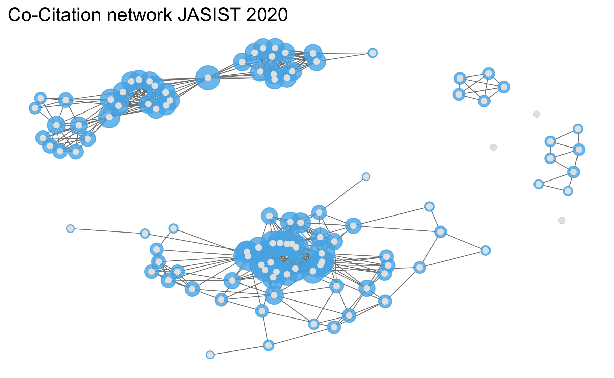

``` r
# tidyverse packages https://www.tidyverse.org/ 
library(dplyr) 
library(tidyr)
library(ggplot2)
# ropensci client for crossref
library(rcrossref) # R Client Crossref remote::install_github("ropensci/rcrossref)
# sna
library(sna)
library(network)
library(ggnet)
```

### Data

JASIST Publikationsmetadaten über Crossref Schnittstelle beziehen

``` r
jasist <- rcrossref::cr_works(filter = list(
  issn = "2330-1643",
  from_pub_date = "2020-01-01",
  until_pub_date = "2020-12-31"
), limit = 250)
jasist_md <- jasist$data
jasist_md
#> # A tibble: 126 × 35
#>    alternative.id    archive container.title   created deposited published.print
#>    <chr>             <chr>   <chr>             <chr>   <chr>     <chr>          
#>  1 10.1002/asi.24432 Portico Journal of the A… 2020-1… 2021-04-… 2021-05        
#>  2 10.1002/asi.24416 Portico Journal of the A… 2020-1… 2021-03-… 2021-04        
#>  3 10.1002/asi.24348 Portico Journal of the A… 2020-0… 2020-11-… 2020-12        
#>  4 10.1002/asi.24407 Portico Journal of the A… 2020-0… 2020-08-… 2020-09        
#>  5 10.1002/asi.24395 Portico Journal of the A… 2020-0… 2021-03-… 2021-02        
#>  6 10.1002/asi.24363 Portico Journal of the A… 2020-0… 2020-04-… 2020-05        
#>  7 10.1002/asi.24429 Portico Journal of the A… 2020-1… 2021-04-… 2021-05        
#>  8 10.1002/asi.24435 Portico Journal of the A… 2020-1… 2020-11-… 2020-12        
#>  9 10.1002/asi.24344 Portico Journal of the A… 2020-0… 2020-11-… 2020-12        
#> 10 10.1002/asi.24279 Portico Journal of the A… 2019-0… 2021-06-… 2020-05        
#> # … with 116 more rows, and 29 more variables: published.online <chr>,
#> #   doi <chr>, indexed <chr>, issn <chr>, issue <chr>, issued <chr>,
#> #   member <chr>, page <chr>, prefix <chr>, publisher <chr>, score <chr>,
#> #   source <chr>, reference.count <chr>, references.count <chr>,
#> #   is.referenced.by.count <chr>, subject <chr>, title <chr>, type <chr>,
#> #   update.policy <chr>, url <chr>, volume <chr>, language <chr>,
#> #   short.container.title <chr>, assertion <list>, author <list>, …
```

### Referenzanalyse

Wie viele und welche Publikationen referenzierten JASIST Artikel 2020?

``` r
# referenzen
jasist_cit <- jasist_md %>%
  select(doi, title, reference) %>%
  unnest(reference)
jasist_cit
#> # A tibble: 4,443 × 15
#>    doi    title     key   unstructured   issue doi.asserted.by first.page DOI   
#>    <chr>  <chr>     <chr> <chr>          <chr> <chr>           <chr>      <chr> 
#>  1 10.10… Describi… e_1_… Andersen J.(2… <NA>  <NA>            <NA>       <NA>  
#>  2 10.10… Describi… e_1_… Atlassian Cor… <NA>  <NA>            <NA>       <NA>  
#>  3 10.10… Describi… e_1_… Atlassian Cor… <NA>  <NA>            <NA>       <NA>  
#>  4 10.10… Describi… e_1_… <NA>           2     crossref        139        10.22…
#>  5 10.10… Describi… e_1_… <NA>           <NA>  <NA>            <NA>       <NA>  
#>  6 10.10… Describi… e_1_… <NA>           <NA>  <NA>            <NA>       <NA>  
#>  7 10.10… Describi… e_1_… <NA>           <NA>  <NA>            <NA>       <NA>  
#>  8 10.10… Describi… e_1_… <NA>           2     crossref        135        10.10…
#>  9 10.10… Describi… e_1_… <NA>           <NA>  <NA>            <NA>       <NA>  
#> 10 10.10… Describi… e_1_… Entertainment… <NA>  <NA>            <NA>       <NA>  
#> # … with 4,433 more rows, and 7 more variables: article.title <chr>,
#> #   volume <chr>, author <chr>, year <chr>, journal.title <chr>,
#> #   volume.title <chr>, series.title <chr>
```

Verteilung

``` r
# referenzen per artikel
cit_stat <- jasist_cit %>%
  group_by(doi) %>%
  summarise(ref_n = n_distinct(key),
            ref_cr = sum(!is.na(DOI))) %>%
  mutate(prop = ref_cr / ref_n)
```

top 10

``` r
cit_stat %>%
  arrange(desc(ref_n))
#> # A tibble: 92 × 4
#>    doi               ref_n ref_cr  prop
#>    <chr>             <int>  <int> <dbl>
#>  1 10.1002/asi.24387   122     67 0.549
#>  2 10.1002/asi.24256   116     71 0.612
#>  3 10.1002/asi.24354   113     44 0.389
#>  4 10.1002/asi.24339   105     63 0.6  
#>  5 10.1002/asi.24342   103     55 0.534
#>  6 10.1002/asi.24362    96     76 0.792
#>  7 10.1002/asi.24390    96     51 0.531
#>  8 10.1002/asi.24358    95     47 0.495
#>  9 10.1002/asi.24367    89     59 0.663
#> 10 10.1002/asi.24415    87     72 0.828
#> # … with 82 more rows
```

Parameter

``` r
# referenzen
summary(cit_stat$ref_n)
#>    Min. 1st Qu.  Median    Mean 3rd Qu.    Max. 
#>    2.00   31.75   45.00   48.29   63.00  122.00
```

``` r
# anteil referenzen mit crossref doi
summary(cit_stat$prop)
#>    Min. 1st Qu.  Median    Mean 3rd Qu.    Max. 
#>  0.1429  0.5097  0.5969  0.6050  0.7228  1.0000
```

Verteilung Referenzen je Artikel

``` r
ggplot(cit_stat, aes(ref_n)) +
  geom_density(fill = "#56b4e9") +
  theme_minimal() +
  labs(x = "Anzahl Referenzen je JASIST-Artikel")
```

<!-- -->

### Netzwerkanalyse

Zitationsdaten

``` r
cit_df <- jasist_cit %>%
  filter(!is.na(DOI)) %>%
  select(doi, ref_doi = DOI) %>%
  mutate(ref_doi = tolower(ref_doi)) %>%
  distinct()
```

Meist zitierte Arbeiten

``` r
cit_df %>%
  count(ref_doi, sort = TRUE)
#> # A tibble: 2,599 × 2
#>    ref_doi                           n
#>    <chr>                         <int>
#>  1 10.1002/asi.24232                 6
#>  2 10.1002/asi.20019                 4
#>  3 10.1191/1478088706qp063oa         4
#>  4 10.1016/0147-1767(85)90062-8      3
#>  5 10.1016/j.lisr.2009.10.003        3
#>  6 10.1016/s0306-4573(99)00027-8     3
#>  7 10.1108/eum0000000007145          3
#>  8 10.1145/2740908.2742839           3
#>  9 10.11645/11.1.2188                3
#> 10 10.2307/41409970                  3
#> # … with 2,589 more rows
```

#### Zitationsmatrix und visualisierung

``` r
# nur Artikel mit mehr als einer Zitation
dois_cit <- cit_df %>%
  count(ref_doi, sort = TRUE) %>%
  filter(n > 1)
my_cit <- cit_df %>%
  filter(ref_doi %in% dois_cit$ref_doi)
my_mat <- as.matrix(table(my_cit$doi, my_cit$ref_doi))
dim(my_mat)
#> [1]  64 107
```

Netzwerkobjekt für die Visualisierung

#### Welche Artikel sind bibliographisch gekoppelt

``` r
mat_t <- my_mat %*% t(my_mat)
dim(mat_t)
#> [1] 64 64
```

Visualisierung

``` r
net <- network::as.network.matrix(mat_t, directed = FALSE)
ggnet::ggnet2(net, size = "degree", color = "#56b4e9", alpha = 0.8) +
  geom_point(aes(color = color), color = "grey90") +
  guides(color = "none", size = "none") +
  labs(title = "Bibliographic coupling JASIST 2020")
```

<!-- -->

#### Welche Artikel werden co-zitiert in JASIST-Artikeln von 2020

``` r
mat_t <- t(my_mat) %*% (my_mat)
dim(mat_t)
#> [1] 107 107
```

Visualisierung

``` r
net <- network::as.network.matrix(mat_t, directed = FALSE)
ggnet::ggnet2(net, size = "degree", color = "#56b4e9", alpha = 0.8) +
  geom_point(aes(color = color), color = "grey90") +
  guides(color = "none", size = "none") +
  labs(title = "Co-Citation network JASIST 2020")
```

<!-- -->
